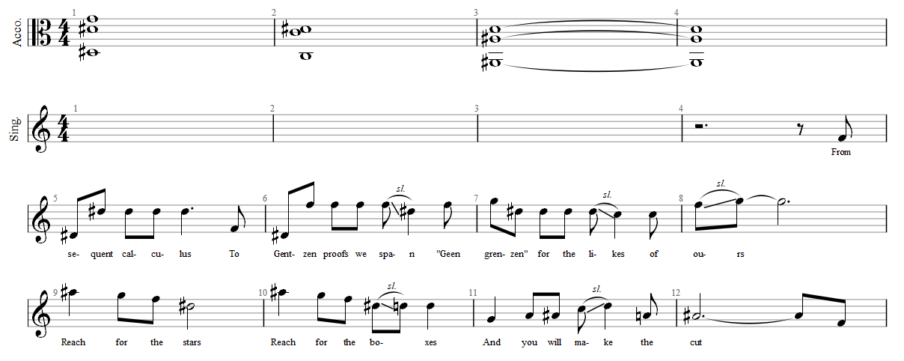

*Published in the Illogician, 2026ii.*

From sequent calculus 
To Gentzen proofs we span 
"Geen grenzen" for the likes of ours  
Reach for the stars 
Reach for the boxes 
And you will make the cut 
In all possible worlds 
We decorate our homes 
Let housing be decidable 
Reach for the stars 
Reach for the boxes 
And you will make the cut 
We strongly normalise 
The right to one’s own type 
Let love be what we want alone 
Reach for the stars 
Reach for the boxes 
And you will make the cut 
And through hardships and luck 
Soon enough we will rise 
To levels of a constructor 
Reach for the stars 
Reach for the boxes 
And you will make the cut 
Reach for the stars 
Reach for the boxes 
And you will make the cut

*Brought to you (unknowingly) by the involuntary ILLC choir:*
- Giuliano Gorgone
- Navid Kianfar
- Magnus Kjærgaard
- Lois Lagerweij
- Frédérique Lalieu
- Dionysis Yusofy

